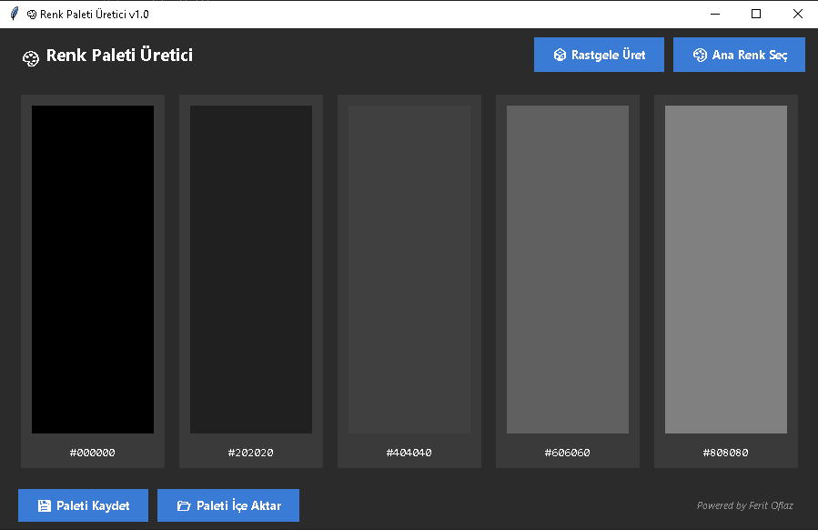

# 🎨 Renk Paleti Üretici v1.0

Modern ve şık bir **renk paleti üretim aracı**.  
Bu uygulama sayesinde ana renk seçerek onun tonlarını görebilir, rastgele paletler oluşturabilir ve her rengin HEX kodunu tek tıkla kopyalayabilirsin.  
Ayrıca oluşturduğun paletleri kaydedebilir veya içe aktararak tekrar kullanabilirsin.

---

## 🖼️ Önizleme

---

## 🚀 Özellikler

- 🎨 **Ana Renk Seçimi:** ColorPicker ile dilediğin rengi seçip tonlarını üret.  
- 🎲 **Rastgele Palet Üretimi:** Her seferinde yeni, ilham verici renkler oluştur.  
- 🔖 **HEX Kodları:** Her renk kutusunda kodu gör, üzerine tıklayarak panoya kopyala.  
- 💾 **Paleti Kaydet:** Ürettiğin paletleri `.json` formatında kaydet.  
- 📂 **Paleti İçe Aktar:** Daha önce kaydettiğin paletleri yeniden yükle.  
- 🧠 **Varsayılan Palet:** Uygulama ilk açıldığında otomatik olarak siyah tonları gösterir.  
- 💡 **Tamamen Türkçe Arayüz.**  
- 🖤 Sağ altta gururla: *Powered by Ferit Oflaz*

---

## 📦 Kurulum ve Kullanım

> Uygulama kurulumsuzdur, doğrudan çalıştırılabilir.

### 1️⃣ Çalıştırma
`dist` klasöründeki **RenkPaletiUretici_v1.0.exe** dosyasına çift tıklayarak uygulamayı başlatabilirsin.

### 2️⃣ Yeni Palet Üretimi
- Üstteki **Ana Renk Seç** butonuna tıklayıp bir renk belirle.  
- Veya **Rastgele Üret** butonuyla otomatik bir palet oluştur.

### 3️⃣ Kopyalama ve Kaydetme
- Her kutunun altındaki HEX koduna tıklayarak kodu kopyalayabilirsin.  
- “Paleti Kaydet” butonuyla mevcut renkleri `.json` dosyasına kaydedebilirsin.  
- “Paleti İçe Aktar” ile daha önce kaydettiğin paleti geri yükleyebilirsin.

---

## 🪄 İndir
📦 [💾 RenkPaletiUretici_v1.0.exe indir](https://github.com/FeritOflaz/Renk-Paleti-Uretici/raw/main/dist/RenkPaletiUretici_v1.0.exe)

---

## ⚙️ Geliştirici Notları
Bu proje tamamen **Python + CustomTkinter** kullanılarak geliştirilmiştir.  
Renk işlemleri için dahili kütüphaneler kullanılmıştır.  
Hiçbir ek bağımlılık gerekmez — sade, taşınabilir, güvenli.

---

## 🪪 Lisans
Bu proje [MIT License](LICENSE) kapsamında lisanslanmıştır.  
Tüm hakları saklıdır © 2025 **Ferit Oflaz**
